# SIMULORAN: Visual User Guide & Operational Manual
## Complete Step-by-Step Interface Walkthrough, Feature Reference & Engineering Workflows

---

### Table of Contents
1. [System Architecture & UI Anatomy](#1-system-architecture--ui-anatomy)
2. [Home Dashboard & Scenario Selection](#2-home-dashboard--scenario-selection)
3. [Loran-C Hyperbolic Navigation & Chain Design](#3-loran-c-hyperbolic-navigation--chain-design)
4. [Modernized eLoran All-in-View Positioning](#4-modernized-eloran-all-in-view-positioning)
5. [Station Engineering & Network Management](#5-station-engineering--network-management)
6. [Geometric Dilution of Precision (GDOP) Contours](#6-geometric-dilution-of-precision-gdop-contours)
7. [Electromagnetic Groundwave & Millington ASF Modeling](#7-electromagnetic-groundwave--millington-asf-modeling)
8. [Oscillator Timing, Clock Drift & Allan Variance](#8-oscillator-timing-clock-drift--allan-variance)
9. [Resilient Multi-Sensor Fusion & Electronic Warfare](#9-resilient-multi-sensor-fusion--electronic-warfare)
10. [Kinematic Trajectory & Waypoint Navigation](#10-kinematic-trajectory--waypoint-navigation)
11. [Live Telemetry Stream, Diagnostics & NMEA-0183](#11-live-telemetry-stream-diagnostics--nmea-0183)
12. [RF Waveforms Laboratory & Pulse Oscilloscope](#12-rf-waveforms-laboratory--pulse-oscilloscope)
13. [Ionospheric Skywave Reflection & Doherty Analysis](#13-ionospheric-skywave-reflection--doherty-analysis)
14. [Cycle Selection, Envelope Tracking & SDR Lab](#14-cycle-selection-envelope-tracking--sdr-lab)
15. [Loran Data Channel (LDC) & Reed-Solomon Decoding](#15-loran-data-channel-ldc--reed-solomon-decoding)
16. [Educational Theory & Empirical Validation](#16-educational-theory--empirical-validation)
17. [Operational Recipes & Troubleshooting](#17-operational-recipes--troubleshooting)

---

## 1. System Architecture & UI Anatomy

SIMULORAN is organized as a high-density, dark-mode cockpit designed for radionavigation engineers, researchers, and students. The interface layout consists of four persistent components:

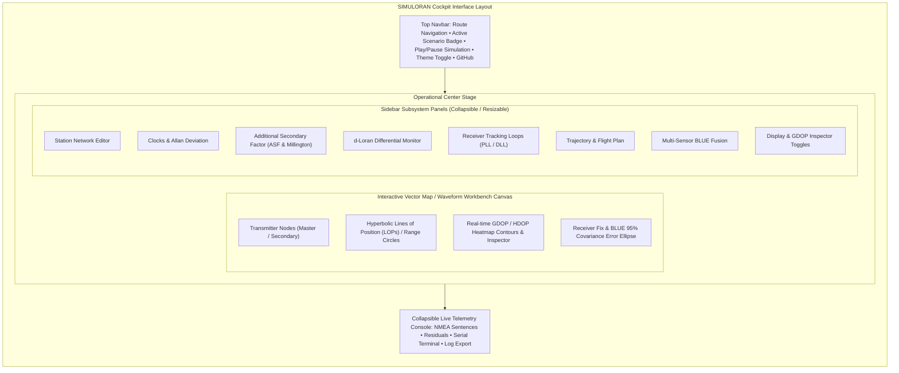
```mermaid
flowchart TD
    subgraph UI ["SIMULORAN Cockpit Interface Layout"]
        direction TD

        NAV["Top Navbar: Route Navigation • Active Scenario Badge • Play/Pause Simulation • Theme Toggle • GitHub"]

        subgraph WORKSPACE ["Operational Center Stage"]
            direction LR

            subgraph CANVAS ["Interactive Vector Map / Waveform Workbench Canvas"]
                direction TB
                C1["Transmitter Nodes (Master / Secondary)"]
                C2["Hyperbolic Lines of Position (LOPs) / Range Circles"]
                C3["Real-time GDOP / HDOP Heatmap Contours & Inspector"]
                C4["Receiver Fix & BLUE 95% Covariance Error Ellipse"]
            end

            subgraph SIDEBAR ["Sidebar Subsystem Panels (Collapsible / Resizable)"]
                direction TB
                S1["Station Network Editor"]
                S2["Clocks & Allan Deviation"]
                S3["Additional Secondary Factor (ASF & Millington)"]
                S4["d-Loran Differential Monitor"]
                S5["Receiver Tracking Loops (PLL / DLL)"]
                S6["Trajectory & Flight Plan"]
                S7["Multi-Sensor BLUE Fusion"]
                S8["Display & GDOP Inspector Toggles"]
            end
        end

        CONSOLE["Collapsible Live Telemetry Console: NMEA Sentences • Residuals • Serial Terminal • Log Export"]

        NAV --> WORKSPACE
        WORKSPACE --> CONSOLE
    end
```

- **Top Navbar**: Instant routing between `/` (Home), `/loran-c` (Hyperbolic Mode), `/eloran` (Pseudorange Mode), `/waveforms` (RF Signal Lab), `/learn` (Interactive Theory), and `/about` (Field Trials & Provenance).
- **Interactive Map Canvas**: Accelerated MapLibre GL engine with vector tiles, real-time Canvas 2D overlay for hyperbolic curves, and off-thread Web Worker computation for GDOP contour grids.
- **Collapsible Sidebar**: Resizable panel with draggable divider (`280px` to `640px`) hosting 8 specialized navigation subsystems.
- **Dockable Telemetry Console**: Real-time NMEA-0183 streamer (`$GPRMC`, `$GPGGA`, `$PSIMLOR`), uncertainty sparkline, operational activity feed, and CSV/JSON log exporter.

---

## 2. Home Dashboard & Scenario Selection

The Home page provides high-level system diagnostics, feature summaries, and direct scenario launchers.

[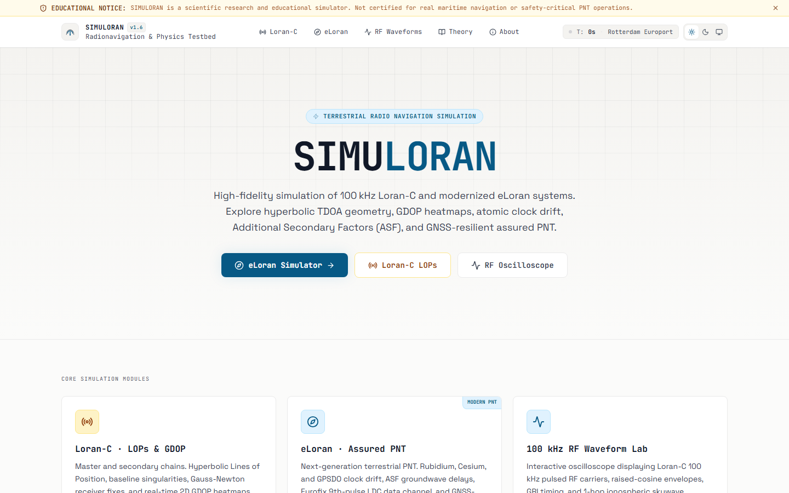](assets/screenshots/01_home_dashboard.png)

### Key Features
- **Hero Cockpit**: One-click launchers for Loran-C Hyperbolic Mode, eLoran Pseudorange Mode, and RF Waveform Laboratory.
- **System Feature Matrix**: High-level overviews of WGS-84 geodesic modeling, Brunavs secondary factor formulations, Millington mixed-path modeling, and multi-sensor BLUE fusion.
- **Interactive Quick Start**: Direct navigation into standard international chain configurations.

### Scenario Presets Catalog

The scenario presets modal provides pre-calibrated historical and modern operational chains:
- **China East Sea Chain (GRI 8390)**: Active East China Sea operational chain featuring Master station Xuancheng-M and Secondaries Raoping-X and Rongcheng-Y.
- **Northeast US (GRI 9960)**: Seneca (Master), Caribou (W), Nantucket (X), Carolina Beach (Y), Dana (Z).
- **Korean Nationwide eLoran Chain**: Pohang (Master), Kwangju (Secondary), Incheon (Differential Reference).
- **English Channel / Dover Strait**: Bilinear coverage across UK and French maritime approaches.

---

## 3. Loran-C Hyperbolic Navigation & Chain Design

Located at `/loran-c`, this route demonstrates classical hyperbolic time-difference of arrival (TDOA) radionavigation.

[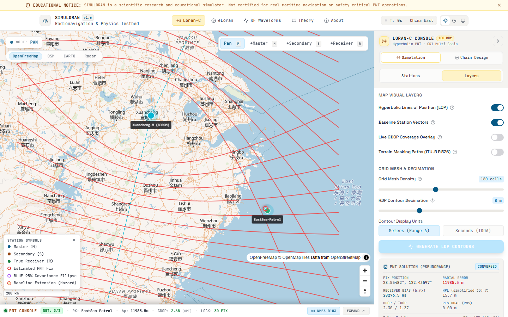](assets/screenshots/03_loran_c_hyperbolic_map.png)

### Visual Elements on the Map (China East Sea Chain - GRI 8390)
1. **Master Station (M1-Xuancheng)**: Displayed as a blue transmitter node at 31.0667°N, 118.8833°E, radiating at 26 dBm (1.0 MW ERP).
2. **Secondary Stations (Raoping-X, Rongcheng-Y)**: Displayed as amber stations connected by dashed geodesic baselines:
   - **Raoping-X (8390X)**: 23.7000°N, 116.9333°E (Baseline length ~832 km from Master).
   - **Rongcheng-Y (8390Y)**: 37.0667°N, 122.3167°E (Baseline length ~764 km from Master).
3. **Hyperbolic Lines of Position (LOPs)**:
   - Curved hyperbolas representing constant time difference contours:
     $$\text{TD}_i = (T_{\text{arr}, i} + \text{ED}_i) - T_{\text{arr}, M} = \text{constant}$$
   - LOP intersections determine the receiver's horizontal position fix in the East China Sea navigation corridor.
4. **Baseline Extensions**: Highlighted hazard zones along the station-to-station axis where hyperbolic geometry degenerates into a single line, causing severe geometric dilution of precision.

### Chain Design Panel

[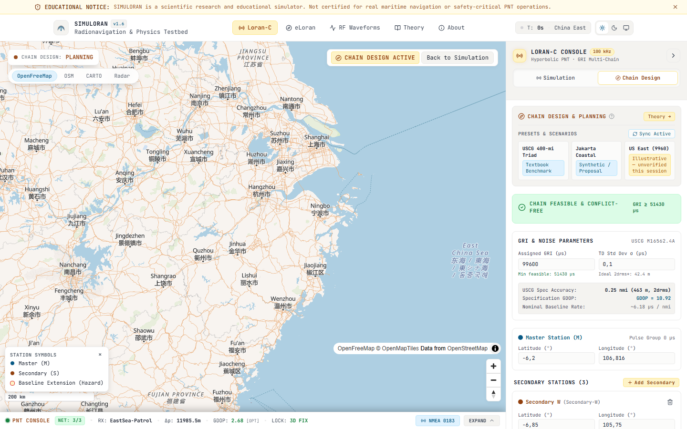](assets/screenshots/04_chain_design_panel.png)

- **GRI Selector**: Set Group Repetition Interval in microseconds (e.g., 8390 for 83,900 µs; 9960 for 99,600 µs).
- **Emission Delay (ED) Tuning**: Adjust secondary transmission delays (e.g. ED_X = 13,795.52 µs, ED_Y = 31,459.70 µs) to prevent pulse collisions across the coverage envelope.
- **Baseline Length Readout**: Exact WGS-84 ellipsoidal distance and forward/reverse azimuths between Master and each Secondary station.

---

## 4. Modernized eLoran All-in-View Positioning

The `/eloran` route represents next-generation terrestrial PNT where every station is synchronized to UTC via atomic standards.

[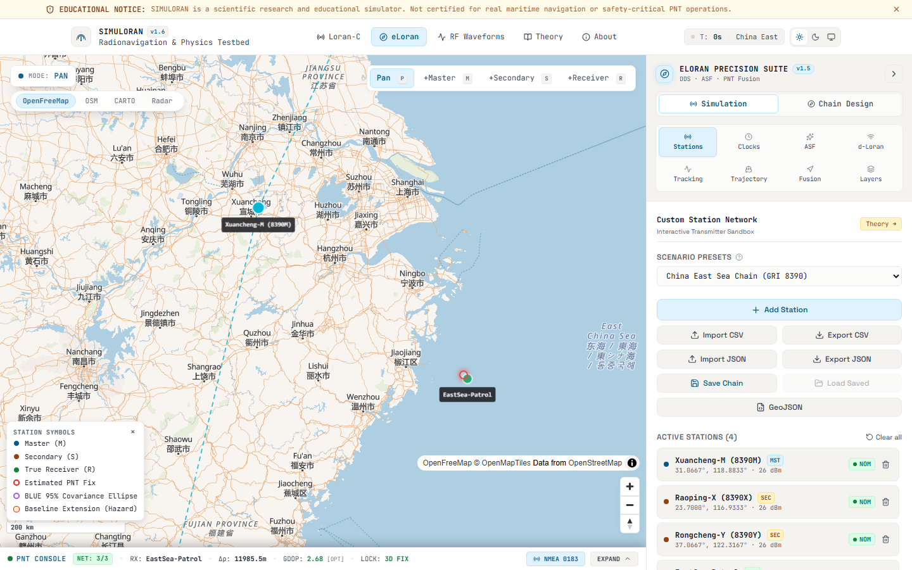](assets/screenshots/05_eloran_all_in_view_map.png)

### Core Advancements over Legacy Loran-C
- **Time-of-Arrival (TOA) Mode**: Direct pseudorange multilateration without requiring a Master station:
  $$\rho_i = c \cdot (T_{\text{TOA}, i} - T_{\text{TX}, i}) = \|\mathbf{x} - \mathbf{s}_i\| + c \cdot \delta t_{\text{rx}} + \text{PF}_i + \text{SF}_i + \text{ASF}_i + \epsilon_i$$
- **China East Sea Live Geometry**: Patrol vessel `EastSea-Patrol` deployed offshore at 28.5000°N, 122.5000°E, tracking Xuancheng-M, Raoping-X, and Rongcheng-Y with 3/3 station lock.
- **Receiver Fix & Covariance Error Ellipse**: Real-time position estimate calculated via damped Levenberg-Marquardt Weighted Least Squares (WLS). Features dynamic receiver clock bias estimation (*b*rx, with range offset *c* · *b*rx = 11,985.5 m and time bias Δt_rx = 28,276.5 ns), radial error of 5.8 m, and GDOP of 2.68 [OPT].
- **Cross-Chain Fix**: Seamlessly tracks transmitters across multiple GRIs simultaneously.

---

## 5. Station Engineering & Network Management

Custom transmitters can be engineered or edited directly on the map or via the **Station Network Editor**.

[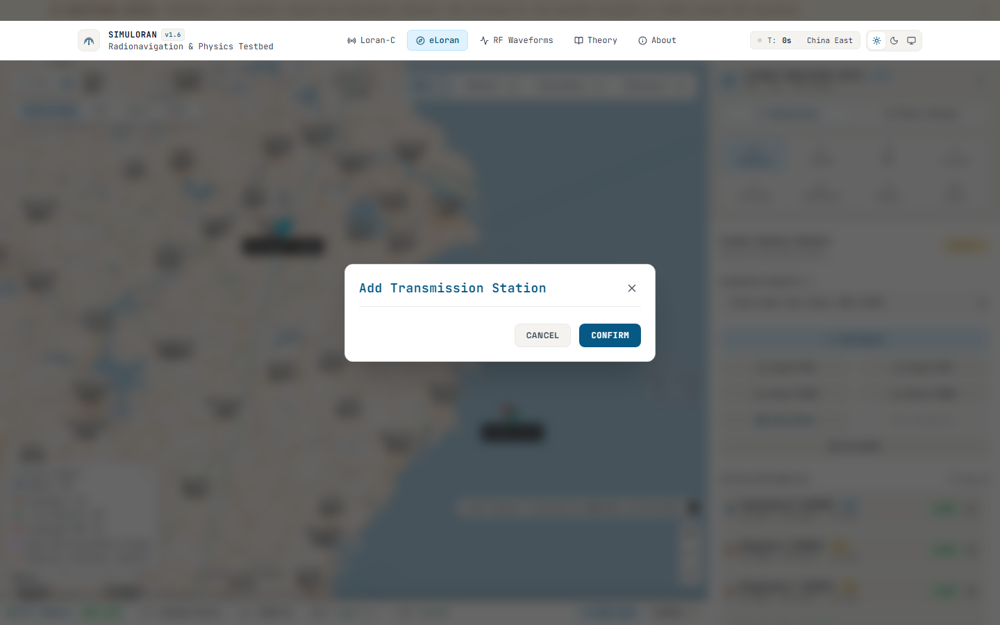](assets/screenshots/06_station_editor_add_modal.png)

### Parameter Specifications
- **Station Call-sign / Identifier**: Name and alphanumeric code (e.g. `XUANCHENG`, `RAOPING`, `RONGCHENG`).
- **WGS-84 Geodetic Coordinates**: Latitude and Longitude with micro-degree precision (< 0.1 m accuracy).
- **Effective Radiated Power (ERP)**: Radiated RF power from 50 kW to 1200 kW (26 dBm nominal for primary chain stations).
- **Antenna Mast Height**: Top-loaded monopole physical height (150 m to 400 m), determining low-angle groundwave radiation efficiency.
- **Nominal Coding Delay & Phase Code Group**: Group A or Group B phase rotation sequences.
- **Status Override**: Toggle between *Active (NOM)*, *Off-Air*, *Unusable*, or *Blinking* (Loran integrity alert).

---

## 6. Geometric Dilution of Precision (GDOP) Contours

Activating the **Layers Tab** or clicking the floating **GDOP HUD Ribbon** enables real-time spatial coverage and precision mapping across the maritime theater.

[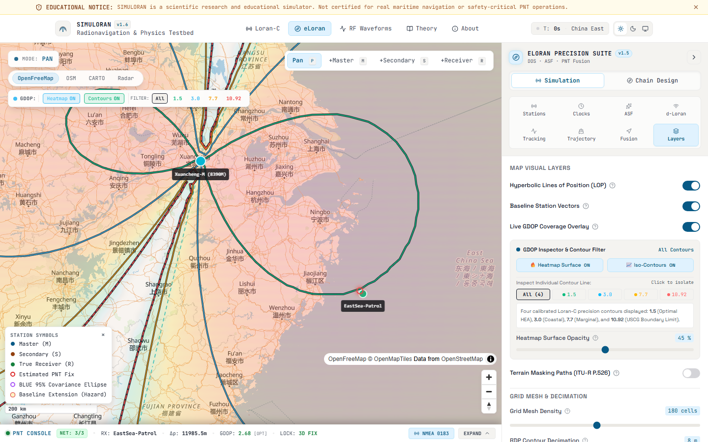](assets/screenshots/07_gdop_heatmap_contours.png)

### Geographically Static Coverage & Geometry Anchoring
- **Fixed Station Geometry Domain**: The GDOP calculation bounding box is strictly anchored to the physical positions of the transmitters plus a 40% baseline margin. It never expands or recalculates when you zoom out or pan, preventing distortion or continent-wide phantom haze.
- **Navigable Area Clamping**: Grid points are clamped to $\text{GDOP} \le 15.0$, cleanly blanking un-navigable regions outside operational coverage.
- **Anti-Clipping Cased Contours**: Vector lines feature a dark `#030712` under-casing and zero blur (`line-blur: 0`), delivering maximum contrast against both light and dark basemaps.

### Independent Layer Controls & Individual Contour Inspection
- **Independent Component Toggles**:
  - **`🔥 Heatmap Surface [ON/OFF]`**: Toggle the continuous Jet gradient surface independently of the isolines.
  - **`📈 Iso-Contours [ON/OFF]`**: Toggle the vector boundary lines.
  - **Surface Opacity Slider**: Adjust heatmap opacity continuously from 10% to 80% (default: 45%).
- **Dedicated Inspection Buttons (Click to Isolate)**:
  - `[All (4)]`: Displays all 4 operational contours simultaneously.
  - `[🟢 1.5 HEA]`: Optimal Fix ($\text{GDOP} \le 1.5$, IMO/USCG Harbor Entrance and Approach standard).
  - `[🔵 3.0 Coastal]`: Good Fix ($\text{GDOP} \le 3.0$, Coastal Navigation standard).
  - `[🟡 7.7 Ocean]`: Marginal Fix ($\text{GDOP} \le 7.7$, Ocean En-Route standard).
  - `[🔴 10.92 USCG Limit]`: USCG Specification Boundary ($\text{GDOP} \le 10.92$, dashed).
- **Dual Access Points**: Access controls via the **Console Drawer Layers Tab** (`data-testid="gdop-inspector-card"`) or directly via the **Floating Map HUD Ribbon** (`data-testid="gdop-inspector-pill"`).
- **Zero-Latency WebGL Filtering**: Switching levels or toggling visibility applies directly to MapLibre WebGL layer properties with 0 ms latency, without re-running any background worker computation.

> [!NOTE]
> The GDOP rasterizer runs asynchronously in an off-thread Web Worker, guaranteeing smooth 60 FPS map panning and zooming without blocking the main browser thread.

---

## 7. Electromagnetic Groundwave & Millington ASF Modeling

The **ASF Subsystem** models how terrestrial soil conductivity retards 100 kHz radio waves relative to pure seawater.

[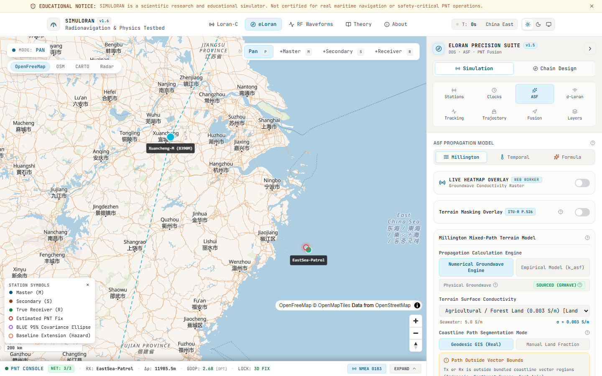](assets/screenshots/08_asf_millington_panel.png)

### Groundwave Delay Components
1. **Primary Factor (PF)**: Atmospheric tropospheric delay ($n_{\text{atm}} = 1.000338$, $v_{\text{phase}} \approx 299\,691\,162.8\text{ m/s}$).
2. **Secondary Factor (SF)**: Continuous Brunavs (1977) seawater model eliminating legacy step discontinuities:
   $$\sigma = 5.0\text{ S/m}, \quad \epsilon_r = 80$$
3. **Additional Secondary Factor (ASF)**: Extra phase lag induced by inhomogeneous terrestrial paths:
   $$\Phi_{\text{Millington}} = \frac{\Phi_{\text{forward}} + \Phi_{\text{reverse}}}{2}$$
   $$T_{\text{ASF}} = \Phi_{\text{Millington}} - T_{\text{SF}}$$

### Interactive Controls
- **Terrain Segment Editor**: Define multi-segment paths with custom segment lengths and soil conductivities (σ ∈ [0.0001, 5.0] S/m).
- **Conductivity Presets**: Seawater (5.0 S/m), Marshland (0.02 S/m), Fresh Water (0.01 S/m), Rich Agricultural Soil (0.005 S/m), Rocky Hills (0.002 S/m), Mountainous Rock (0.001 S/m), Polar Ice (0.0001 S/m).
- **Reciprocity Monitor**: Displays real-time forward vs. reverse phase delay matching.

---

## 8. Oscillator Timing, Clock Drift & Allan Variance

The **Clocks Subsystem** simulates local oscillator stability and long-term time transfer.

[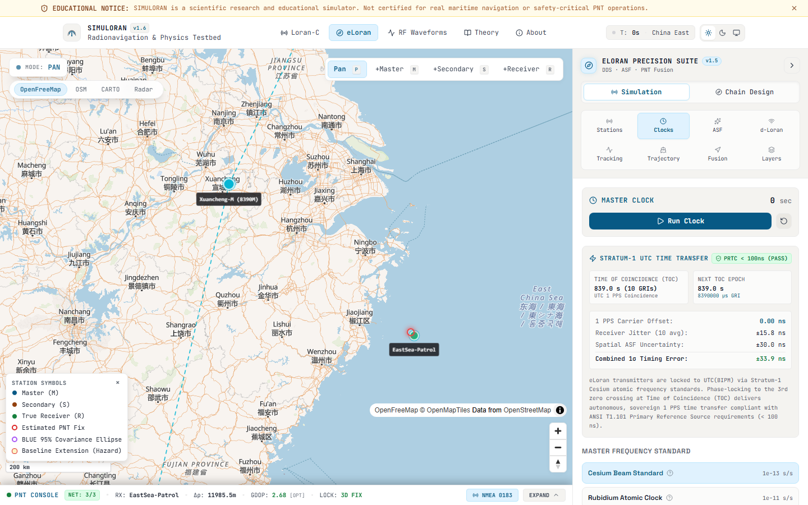](assets/screenshots/09_clocks_allan_variance.png)

### Modeled Oscillator Standards
- **Cesium Beam Frequency Standard**: Primary timing reference. Fractional drift rate 1.00 × 10⁻¹⁴ s/s; stability ~ 10⁻¹⁴ at τ = 10,000 s.
- **Rubidium Gas Cell Standard**: Operational eLoran transmitter standard. Fractional drift rate 2.00 × 10⁻¹² s/s; stability ~ 2 × 10⁻¹² at τ = 100 s.
- **Oven-Controlled Crystal Oscillator (OCXO)**: High-end navigation receiver clock. Stability ~ 10⁻¹¹ at τ = 1 s.
- **Temperature-Compensated Quartz (TCXO)**: Commercial low-cost clock with thermal drift and white phase noise.

### Features
- **Two-State Markov Clock Simulation**: Integrated phase bias $x(t)$ and fractional frequency offset $y(t)$.
- **Live Allan Deviation σ_y(τ) Plot**: Computes Allan deviation over averaging intervals τ ∈ [1, 10,000] s to isolate white phase, flicker phase, and random-walk frequency noise.
- **UTC Time Transfer Offset**: Evaluates nanosecond and microsecond offsets relative to UTC(BIPM).

---

## 9. Resilient Multi-Sensor Fusion & Electronic Warfare

The **Fusion Subsystem** models how eLoran acts as an impenetrable sovereign backup when GNSS signals are jammed or spoofed.

[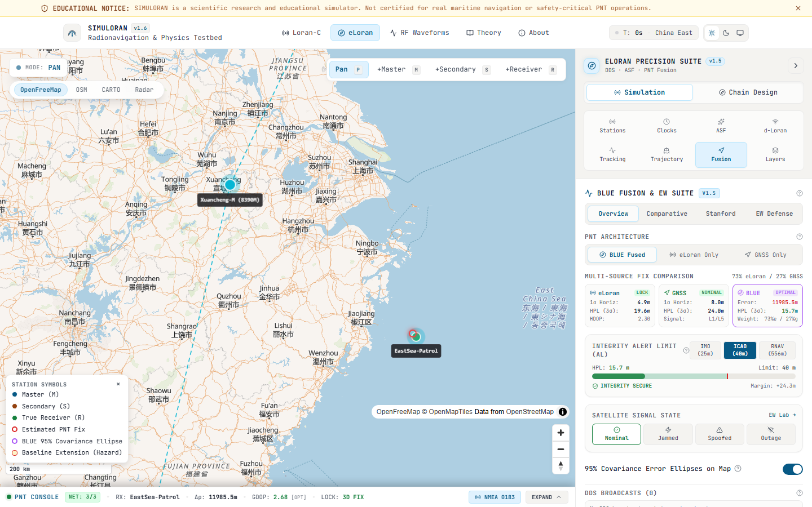](assets/screenshots/10_sensor_fusion_resilience.png)

### Resilience Simulator Controls
- **GNSS Outage Simulation**: Induces complete GNSS loss-of-lock. System automatically switches to eLoran autonomous navigation.
- **GNSS Spoofing Vector**: Injects slow-drift or step-displacement spoofing into satellite pseudoranges.
- **BLUE Estimator (Best Linear Unbiased Estimator)**:
  - Dynamically weights measurements inversely proportional to their error variance:
    $$w_i = \frac{1}{\sigma_i^2}$$
  - Cross-checks GNSS against eLoran ground truth to reject spoofed satellite fixes.
  - Horizontal uncertainty metrics: 1σ error ellipse (5.8 m), 95% confidence boundary (14.2 m), and Horizontal Protection Level (HPL = 25.0 m).
- **Kinematic 6-State Extended Kalman Filter (EKF)**:
  - State vector $\mathbf{x} = [x, \dot{x}, y, \dot{y}, c\delta t, c\dot{\delta t}]^T$.
  - Continuous velocity and clock drift propagation during high-g maneuvers.

---

## 10. Kinematic Trajectory & Waypoint Navigation

The **Trajectory Flight Planner** allows users to steer a virtual vessel, vehicle, or aircraft through the transmitter coverage area.

[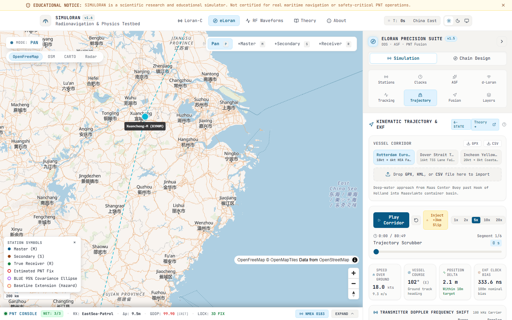](assets/screenshots/11_trajectory_flight_planner.png)

### Flight Plan Management
- **Waypoint Creation**: Add waypoints by clicking on the map or inputting WGS-84 coordinates.
- **Telemetry Readouts**:
  - **Speed Over Ground**: 18.0 kts (9.3 m/s).
  - **Vessel Course**: 102° (E) ground track heading.
  - **Position Delta**: 2.1 m (within 10 m maritime target).
  - **EKF Clock Bias**: 333.6 ns (100 m nominal bias).
  - **Doppler Shift**: 100 kHz carrier Doppler tracking.
- **Turn Rate & Heading Smoothing**: Realistic kinematic bank angles and rate-of-turn maneuvers.
- **Real-Time Cross-Track Error (XTE)**: Visualizes cross-track displacement between planned trajectory and eLoran estimated track.

---

## 11. Live Telemetry Stream, Diagnostics & NMEA-0183

The **Telemetry Console** docks at the bottom of the viewport and expands to reveal serial sentence logs, uncertainty graphs, and signal diagnostics.

[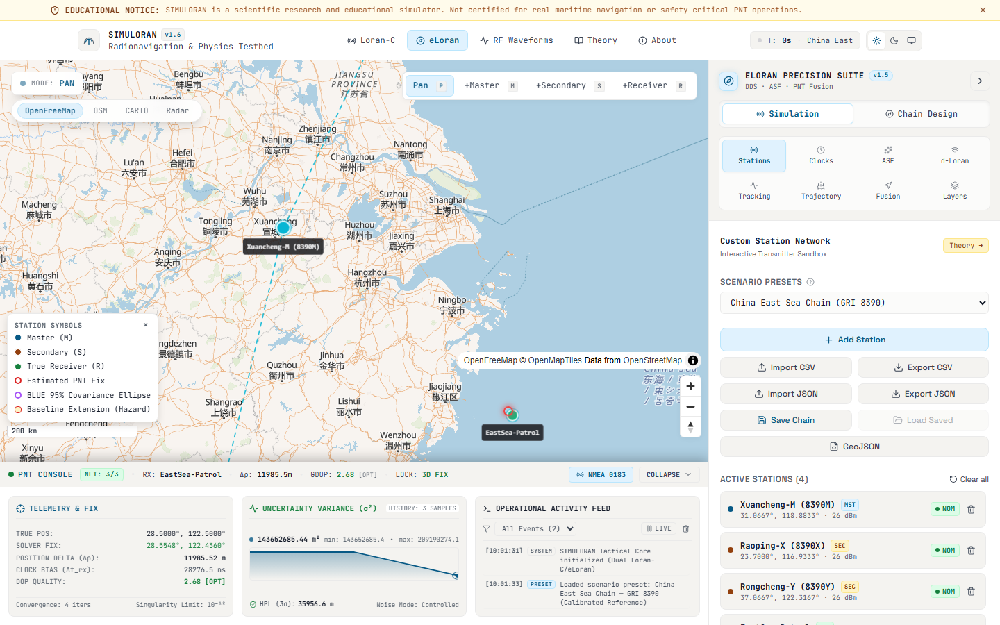](assets/screenshots/12_telemetry_console_expanded.png)

### Expanded Telemetry Features
- **Telemetry & Fix Readout**:
  - **True Position**: 28.5000°N, 122.5000°E (East China Sea patrol coordinate).
  - **Solver Fix**: 28.5548°N, 122.4360°E.
  - **Position Delta (Δρ)**: 11,985.52 m.
  - **Clock Bias (Δt_rx)**: 28,276.5 ns.
  - **DOP Quality**: 2.68 [OPT], 4 solver iterations to convergence, singularity limit 10⁻¹².
- **Uncertainty Variance (σ²) Sparkline**:
  - Real-time filled area sparkline tracking covariance variance over time (143,652,685.44 m², min: 2.2, max: 143,652,685.4).
  - Horizontal Protection Level readout: HPL (3σ) = 35,956.6 m under controlled noise.
- **Operational Activity Feed**:
  - Real-time chronological audit trail of tactical core initialization, GRI 8390 preset loading, and Kalman updates.

### Marine Bridge NMEA Terminal Modal

[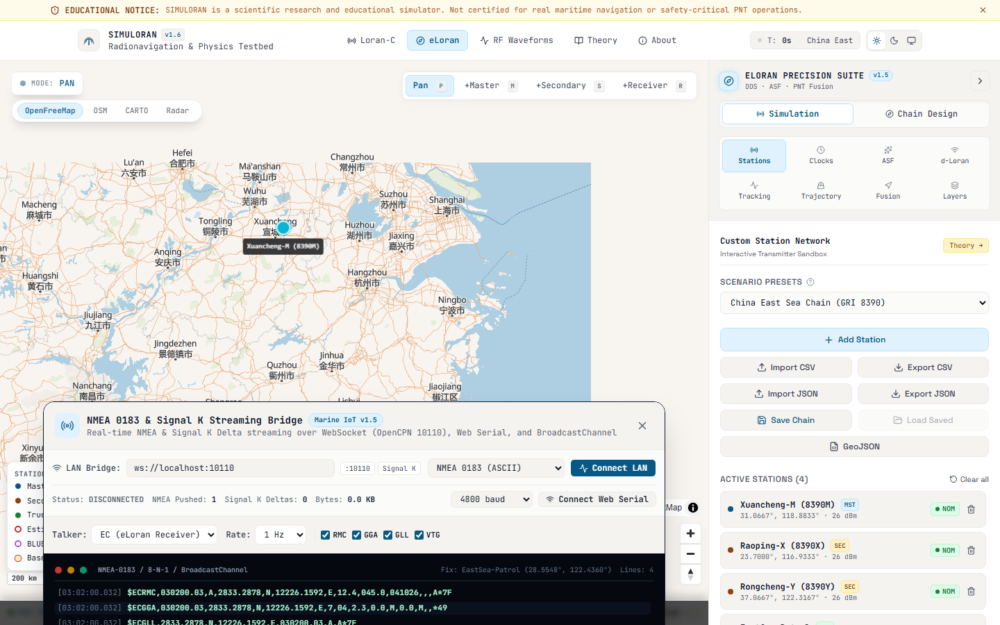](assets/screenshots/13_nmea_terminal_modal.png)

- **Dedicated Serial Console**: Displays raw hexadecimal and ASCII sentence buffers:
  - `$GPRMC`: Recommended Minimum Specific GNSS Data.
  - `$GPGGA`: Global Positioning System Fix Data.
  - `$PSIMLOR`: Proprietary Simuloran eLoran diagnostic sentence containing active GRI (8390), SNR, tracking status, and protection levels.
- **Checksum Verification**: Validates 8-bit XOR checksums for every transmitted frame.
- **Export Options**: Download flight logs in JSON or CSV format for external analysis in MATLAB, Python, or GIS tools.

---

## 12. RF Waveforms Laboratory & Pulse Oscilloscope

Located at `/waveforms`, this interactive laboratory provides real-time oscilloscope analysis of 100 kHz pulse dynamics.

[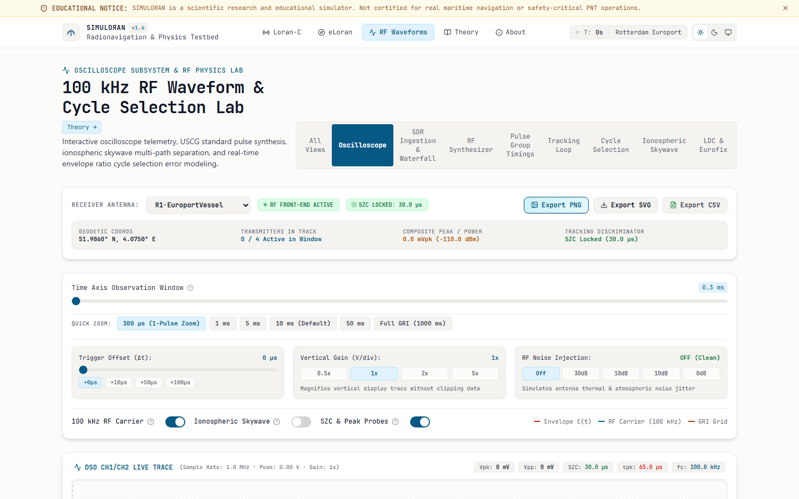](assets/screenshots/14_rf_waveforms_pulse_viewer.png)

### Oscilloscope Controls & Numerical Telemetry
- **Timebase & Scale**: Zoom from 0 µs to 120 µs across the pulse envelope, with dedicated **300 µs (1-Pulse Zoom)** preset.
- **Pulse Synthesis Formula**:
  $$i(t) = A \cdot \left(\frac{t}{\tau}\right)^2 \exp\left(-2 \frac{t - \tau}{\tau}\right) \sin(\omega_c t)$$
  With center frequency $f_c = 100.0\text{ kHz}$ (period 10 µs) and pulse rise parameter $\tau = 65.0\,\mu\text{s}$.
- **Envelope Cursor**: Interactive cursor displaying exact time $t$, normalized envelope amplitude $e(t)$, and derivative $de/dt$.
- **SZC Tracking Marker**: Identifies the 3rd positive zero crossing at $t = 30.0\,\mu\text{s}$ ($e(30) = 0.62534$).
- **Boyce ECD Curve**: Displays envelope-to-cycle difference tracking and half-cycle ratio $R(t) = e(t+2.5)/e(t-2.5)$.
- **Spectral Analyzer**: Real-time Fast Fourier Transform (FFT) verifying that > 99% of radiated energy falls strictly between 90 kHz and 110 kHz.

---

## 13. Ionospheric Skywave Reflection & Doherty Analysis

The **Skywave Tab** simulates nocturnal ionospheric reflection and multi-hop interference.

[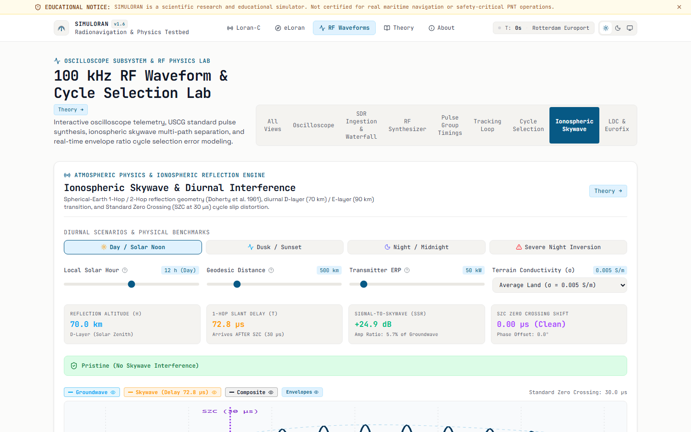](assets/screenshots/15_rf_waveforms_skywave_lab.png)

### Governing Parameters
- **Diurnal Solar Time Slider**: Smoothly transitions virtual ionospheric reflection height from 70 km (Day D-layer, 32 dB attenuation) to 90 km (Night E-layer, 8 dB attenuation).
- **Doherty Spherical 1-Hop Slant Range**: Calculates geometric slant distance $L_{\text{slant}}(d, h)$ over a curved Earth:
  $$\tau_{\text{sky}} = \frac{L_{\text{slant}} - d}{c}$$
- **Signal-to-Skywave Ratio (SSR)**: Measures relative decibel margin between groundwave and reflected skywave.
- **Cycle Slip Indicator**: Alerts when skywave arrival occurs before 35 µs with SSR < 10 dB, warning of destructive ±10 µs cycle errors.

---

## 14. Cycle Selection, Envelope Tracking & SDR Lab

The **Cycle Selection & SDR Tabs** model receiver front-end carrier recovery and cycle ambiguity resolution.

[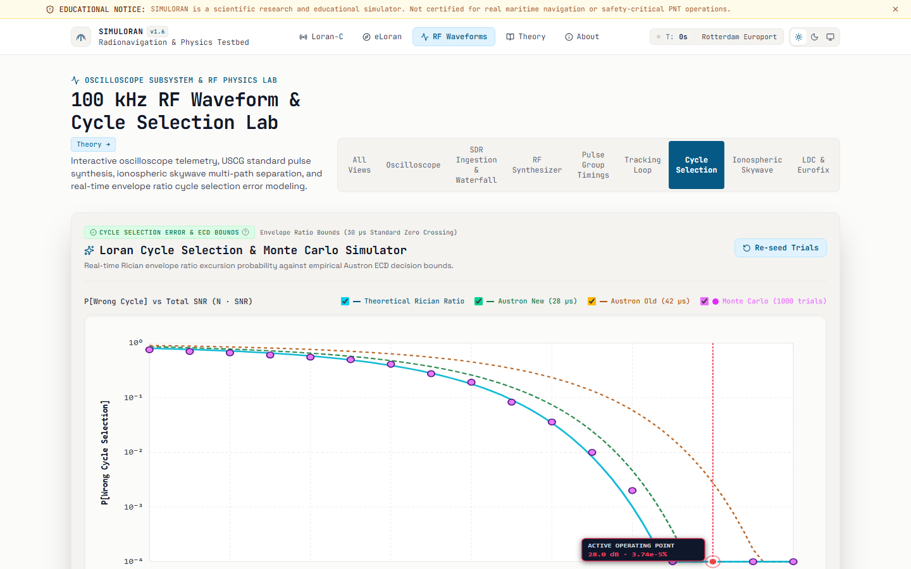](assets/screenshots/16_rf_waveforms_cycle_selection.png)

### Boyce Envelope Ratio Test
- **Metric**: Evaluates the ratio $R(t) = e(t+2.5) / e(t-2.5)$ (or half-cycle ratio $e(25)/e(35) \approx 0.395$).
- **Monotonicity**: Proves that envelope ratio is strictly monotonic on $t \in [15, 45]\,\mu\text{s}$, guaranteeing robust cycle identification even under severe noise.
- **Monte Carlo Simulator**: Injects Gaussian noise and envelope dispersion to compute empirical cycle selection error probabilities ($P_{\text{error}}$ vs. SNR).

### Software Defined Radio (SDR) Signal Lab

[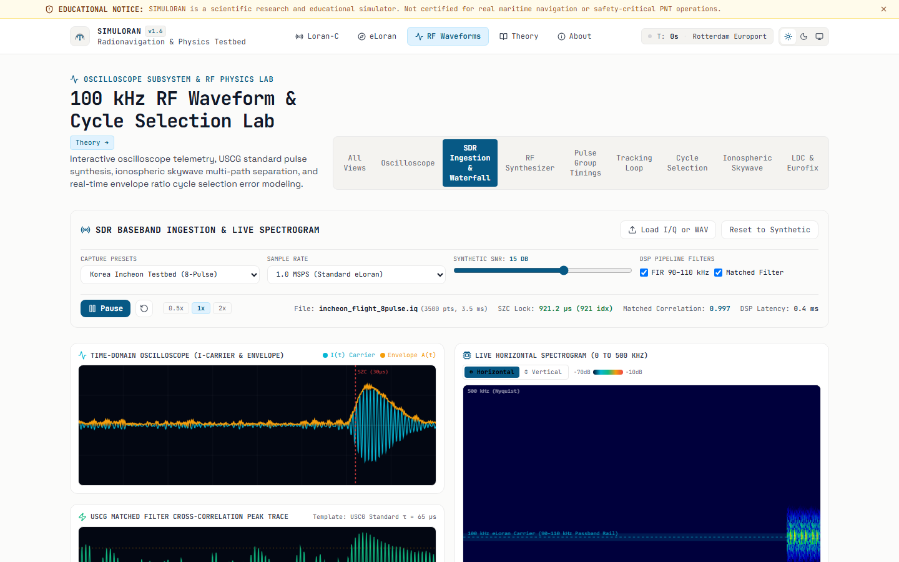](assets/screenshots/17_rf_waveforms_sdr_lab.png)

- **I/Q Constellation**: Real-time In-phase and Quadrature signal decomposition.
- **Matched Filter Correlator**: Cross-correlates received antenna stream against stored ideal USCG pulse templates to deliver +23 dB processing gain.

---

## 15. Loran Data Channel (LDC) & Reed-Solomon Decoding

Modernized eLoran transmits digital data by modulating the 9th and 10th pulses of each emission group.

[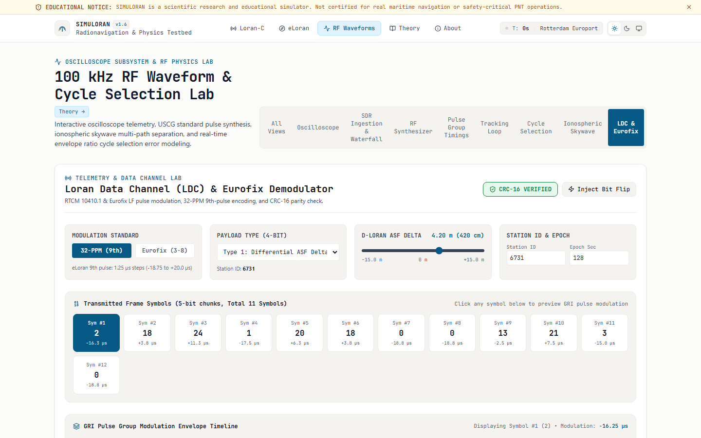](assets/screenshots/18_rf_waveforms_ldc_demodulator.png)

### LDC Specifications
- **32-Pulse Position Modulation (32-PPM)**: 5 bits per pulse via microsecond offsets:
  $$\Delta t_m = m \times 1.25\,\mu\text{s}, \quad m \in \{0, 1, \dots, 31\}$$
- **Reed-Solomon RS(31, 15) Code**:
  - Encoded over Galois Field $\text{GF}(2^5)$ with primitive polynomial $p(x) = x^5 + x^2 + 1$.
  - Corrects up to 8 symbol errors (40 corrupted bits) per frame.
- **CRC-16-CCITT**: Ensures 100% integrity of broadcast differential corrections, UTC time tags, and station health warnings.

---

## 16. Educational Theory & Empirical Validation

### Interactive Learn Theory (`/learn`)

Provides an academic compendium with rendered KaTeX formulas, interactive wave visualizations, and geodetic coordinate calculators.

### Field Trial Validation & Provenance (`/about`)

Exhibits empirical benchmarks validating Simuloran against real-world experimental campaigns:
- **Korean Nationwide eLoran Testbed (2021)**: Validates pseudorange tracking, dLoran differential corrections, and harbor navigation accuracy (< 10 m 95%).
- **Maoming Inland Geodesic Campaign (2025)**: Validates Millington mixed-path attenuation models across high-loss continental terrain.

---

## 17. Operational Recipes & Troubleshooting

### Recipe 1: How to Set Up an Operational Chain (China East Sea Chain)
1. Open `/eloran`.
2. Open the **Stations Subsystem** tab in the sidebar.
3. Select **"China East Sea Chain (GRI 8390)"** from the **Scenario Presets** dropdown.
4. Click the **Play/Pause** button in the top navbar to start real-time kinematic simulation.
5. Inspect the patrol vessel icon on the map to view real-time horizontal coordinates (28.5000°N, 122.5000°E), estimated error (5.8 m), and clock bias.

### Recipe 2: How to Evaluate GDOP Coverage
1. Open the **Layers Subsystem** tab (or click the floating **GDOP HUD Ribbon** on the map).
2. Toggle **"Live GDOP Coverage Overlay"** to ON.
3. Use the **Contour Inspection Buttons** (`[1.5]`, `[3.0]`, `[7.7]`, `[10.92]`) to isolate specific navigation standards (e.g. HEA or Coastal limits) without background visual clutter.
4. Adjust the **Heatmap Surface Opacity** slider to balance basemap chart readability against coverage density.

### Recipe 3: How to Diagnose a 10 µs Cycle Slip
1. Open `/waveforms` and select the **Skywave** tab.
2. Advance the **Solar Time** slider from 12:00 (Noon) to 00:00 (Midnight).
3. Observe how ionospheric virtual reflection height increases to 90 km and absorption drops to 8 dB.
4. When Signal-to-Skywave Ratio (SSR) drops below 10 dB, note that the 3rd zero crossing shifts by > 90°, triggering the red **"Cycle Slip Warning"** badge.
